## YETRIA Career Guidance Platform

Professional, end-to-end platform for data-driven career guidance combining a modern React frontend, a FastAPI backend, and an ML pipeline with CatBoost/LightGBM models.

— Built by: Gül ERTEN, Tuba SARIKAYA —

### Highlights
- Modern UX with animated, responsive UI and protected routes
- Production-grade API with authentication and model serving
- Reproducible ML pipeline, grid-search optimization, and rich reports
- Clear artifacts and reporting structure for model lifecycle transparency

---

## Demo Video

Add your application walkthrough video link below. Optionally, include a QR code image for printed submissions.

- Demo URL: [Add your link here]

---

## System Architecture

```mermaid
flowchart LR
  classDef neutral fill:#1f2937,stroke:#334155,color:#e5e7eb,rx:10,ry:10;
  classDef accent fill:#06b6d4,stroke:#22d3ee,color:#042f2e,rx:10,ry:10;
  classDef ghost fill:#0b1220,stroke:#334155,color:#94a3b8,rx:10,ry:10;

  subgraph Frontend
    UI(UI):::neutral --> Router(Router):::neutral
    Router --> FAuth(Auth):::neutral
    Router --> Results(Results):::neutral
    Router --> Scenarios(Scenarios):::neutral
  end

  subgraph Backend
    API(API):::neutral --> SEC[[Security & Auth – JWT]]:::accent --> Services(Services):::neutral
    Services --> Loader(Model Loader):::neutral
    Services --> DB[(Database)]:::neutral
    Cache(Model Cache):::ghost
    Queue((Queue – optional)):::ghost
  end

  subgraph ML
    Prep(Preprocess):::neutral --> Feat(Features):::neutral --> Tune(Grid Search):::neutral --> Eval(Evaluate):::neutral
  end

  Frontend -.->|HTTPS| API
  Services --> Prep
  Prep --> Feat --> Tune --> Eval --> Loader
  Loader --- Cache
  Services -.->|optional| Queue
  Services -->|artifacts path| Loader
```



---

## Repository Layout

### Backend Structure


### Frontend Structure


---

## Getting Started

### Prerequisites
- Node.js 18+
- Python 3.10+

### Backend setup
```bash
cd backend
python -m venv .venv && source .venv/bin/activate  # Windows: .venv\\Scripts\\activate
pip install -r requirements.txt
```

Start the API server:
```bash
python scripts/start_server.py
```

Key paths:
- Models are saved in `backend/artifacts/`
- Reports and charts are in `backend/reports/`
- Data files reside in `backend/data/`

### Frontend setup
```bash
cd frontend
npm install
npm run dev
```

Open the local dev URL printed by Vite.

---

## Data and ML Pipeline


## Reproducible scripts

- Analysis visuals on prepared scores (exploratory):

  ```bash
  # From backend/
  python scripts/ml/run_analysis.py
  ```
  - Input: `backend/data/aggregated_scores.csv`
  - Output (to `backend/reports/`): persona correlation heatmaps, radar and box plots and feature importance.

- Model optimization (CatBoost & LightGBM):

  ```bash
  # From backend/
  python scripts/ml/run_gridsearch.py
  ```
  - Input: `backend/data/model_training_data.csv`
  - Process: randomized/grid search with cross‑validation, overfitting checks
  - Output: timestamped models in `backend/artifacts/` and detailed metrics/plots in `backend/reports/` (ROC, confusion matrix, feature importance, learning curves, summaries).

---

## Evaluation Summary 
### Cross-Validation Performance (5-fold)

| Model | Accuracy | ROC-AUC | F1-Score | Status |
|-------|----------|---------|----------|--------|
| **CatBoost** | 0.7620 | 0.8292 | 0.7973 | ✅ Best CV |
| **LightGBM** | 0.7488 | 0.8191 | 0.7851 | ✅ Good CV |

### Test Set Performance

| Model | Accuracy | ROC-AUC | Precision | Recall | F1-Score | Balanced Acc | Status |
|-------|----------|---------|-----------|--------|----------|--------------|--------|
| **CatBoost** | 0.7876 | 0.8483 | 0.7934 | 0.8467 | 0.8192 | 0.7782 | ✅ Balanced |
| **LightGBM** | 0.7867 | 0.8518 | 0.7981 | 0.8365 | 0.8168 | 0.7788 | ✅ Consistent |

### Key Findings
- **No Overfitting**: Both models generalize well with consistent CV and test performance
- **High Discrimination**: ROC-AUC ~0.85 indicates excellent binary classification capability
- **Balanced Performance**: Precision and recall are well-balanced across both models
- **Model Stability**: CatBoost shows slightly better consistency, LightGBM has marginally higher ROC-AUC

---

## Frontend UX and Navigation


---

## Authentication Flow


---

## Generated Reports

### Analysis Reports
- **`competency_box_plots.png`** - Shows competency score distributions across different career groups
- **`competency_radar_chart.png`** - Displays competency profiles as radar charts for visual comparison
- **`corr_heatmap_Bilgisayar_Muhendisi.png`** - Correlation heatmap showing relationships between competencies for Computer Engineers
- **`corr_heatmap_Doktor.png`** - Correlation heatmap showing relationships between competencies for Doctors

### Model Evaluation Reports (CatBoost & LightGBM)
- **`*_confusion_matrix_test_*.png`** - Confusion matrix showing model prediction accuracy on test data
- **`*_cv_vs_test_comparison_*.png`** - Compares cross-validation vs test performance to detect overfitting
- **`*_evaluation_report_*.txt`** - Detailed text report with all performance metrics
- **`*_pr_curve_*.png`** - Precision-Recall curve showing model performance across different thresholds
- **`*_roc_curve_*.png`** - ROC curve showing true positive rate vs false positive rate
- **`model_feature_importance_*.png`** - Feature importance ranking showing which competencies matter most for predictions

---